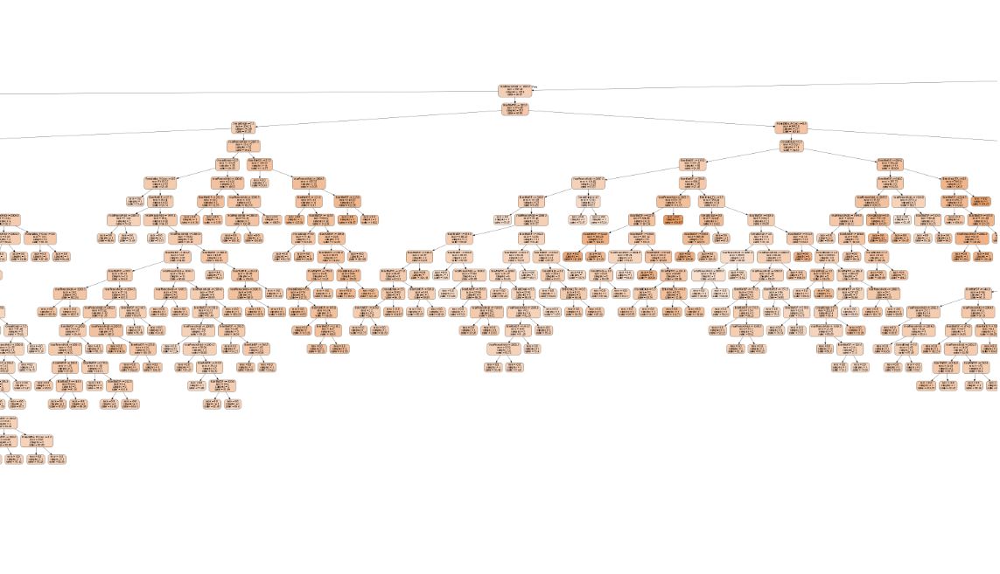

# Housing Prices: Advanced Regression Techniques
------------------

Ask a home buyer to describe their dream house, and they probably won't begin with the height of the 
basement ceiling or the proximity to an east-west railroad. But this playground competition's dataset 
proves that much more influences price negotiations than the number of bedrooms or a white-picket fence.

 With 79 explanatory variables describing (almost) every aspect of residential homes in Ames, Iowa, 
 this competition challenges you to predict the final price of each home.
 
[Kaggle Competition](https://www.kaggle.com/c/house-prices-advanced-regression-techniques)

## Cleaning Data 
------------
(One Hot Encoding, grabbed features using a heatmap(pic))

## Modeling Data 
-------
(KNN, Decision Tree, Linear Regression(pic of graphs))

## Summary
------
